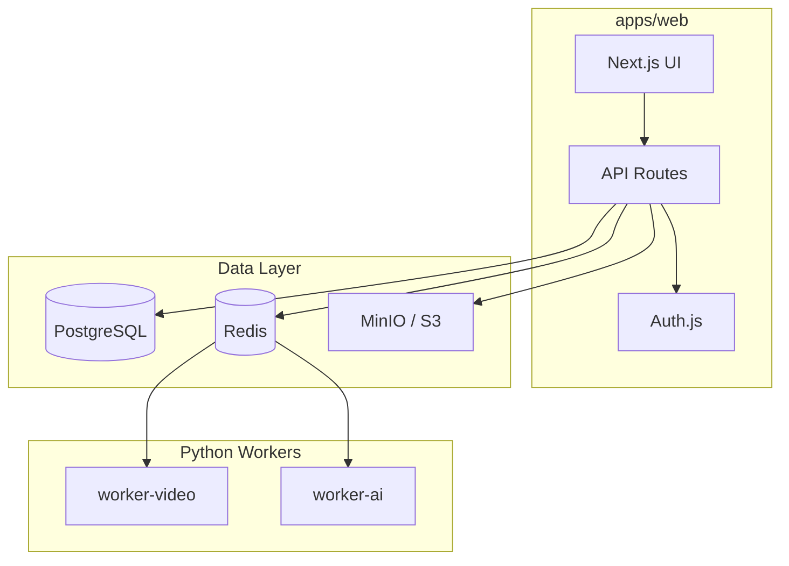

# ClipForge

**Turn long-form videos into platform-ready Shorts, Reels, and TikToks** with AI-assisted clipping, captions, and publishing.

ClipForge turns long-form sources into short-form clips with AI-assisted editing and publishing. Rights confirmation and discovery guardrails are planned for a later phase.

## Architecture



| Layer | Stack |
|-------|--------|
| Frontend + API | Next.js 15, React 19, TypeScript, Tailwind |
| Auth | Auth.js v5 (Prisma adapter) |
| Database | PostgreSQL + Prisma |
| Queue | Redis + BullMQ |
| Storage | S3-compatible (MinIO locally) |
| Workers | FastAPI + FFmpeg + Faster-Whisper (phased) |

## Monorepo layout

```txt
ClipForge/
├── apps/web/              # Next.js app (UI + /app/api)
├── packages/
│   ├── config/            # Shared TS configs
│   ├── database/          # Prisma schema & client
│   └── shared/            # Types, Zod schemas, constants
├── services/
│   ├── worker-video/      # Import, audio, FFmpeg render
│   └── worker-ai/         # Transcription, clip scoring
├── infra/docker-compose.yml
├── developer.md           # Docker & local dev setup
├── start.sh               # Start without Docker
├── start-docker.sh        # Start with Docker infra
├── docs/                  # Product spec
├── CHECKLIST.md           # Implementation progress
└── README.md
```

## Prerequisites

- **Node.js** 20+
- **pnpm** 9+
- **PostgreSQL** (required) — via Docker, Homebrew, or hosted (Neon, Supabase, etc.)
- **Redis** (recommended) — optional for scaffold; required for BullMQ workers later
- **Docker** (optional) — easiest way to run Postgres, Redis, and MinIO together
- **FFmpeg** (for workers, Phase 2+)
- **Python** 3.11+ (for workers, optional in scaffold)

## Quick start

**Full setup guide (Docker and without):** [developer.md](developer.md)

### One-command start

```bash
chmod +x start.sh start-docker.sh

# With Docker (Postgres + Redis + MinIO)
./start-docker.sh

# Without Docker (local or hosted Postgres must already be running)
./start.sh
```

Open http://localhost:3000 — sign in with `demo@clipforge.local`.

Optional demo seed: `CLIPFORGE_SEED=1 ./start.sh`

### Manual setup

```bash
cp .env.example .env
cp .env.example apps/web/.env
# Set AUTH_SECRET (openssl rand -base64 32)

docker compose -f infra/docker-compose.yml up -d   # skip if not using Docker

pnpm install
pnpm db:generate
pnpm --dir packages/database exec prisma migrate deploy
pnpm dev
```

### 5. Python workers (optional)

```bash
# Terminal A
cd services/worker-video && pip install -r requirements.txt
uvicorn app.main:app --reload --port 8001

# Terminal B
cd services/worker-ai && pip install -r requirements.txt
uvicorn app.main:app --reload --port 8002
```

Health: http://localhost:8001/health · http://localhost:8002/health

## Environment variables

| Variable | Description |
|----------|-------------|
| `DATABASE_URL` | PostgreSQL connection string |
| `REDIS_URL` | Redis for BullMQ |
| `AUTH_SECRET` | Auth.js session secret |
| `AUTH_URL` | App URL (e.g. `http://localhost:3000`) |
| `AUTH_GOOGLE_ID` / `AUTH_GOOGLE_SECRET` | Optional Google OAuth |
| `S3_*` | Object storage (MinIO in dev) |
| `OPENAI_API_KEY` | LLM clip scoring (Phase 4) |
| `YOUTUBE_API_KEY` | Discovery & metadata (Phase 7) |
| `WORKER_VIDEO_URL` / `WORKER_AI_URL` | Worker base URLs |

See [.env.example](.env.example) for defaults.

## Scripts

| Command | Description |
|---------|-------------|
| `pnpm dev` | Start Next.js dev server |
| `pnpm db:generate` | Generate Prisma client |
| `pnpm db:migrate` | Apply migrations |
| `pnpm db:studio` | Open Prisma Studio |
| `pnpm db:seed` | Seed demo workspace |
| `pnpm typecheck` | TypeScript check (all packages) |

## API overview (scaffold)

- `POST /api/sources/validate` — Parse & validate URL
- `POST /api/sources/import` — Create source + enqueue import job
- `GET /api/sources` — List workspace sources
- `POST /api/clips/generate-candidates` — Queue AI scoring
- `POST /api/publish/youtube` | `tiktok` | `instagram` — Publishing stubs
- `GET /api/discover/youtube/most-popular` — Discovery stub + rights warning

Full spec: [docs/clipforge_ai_shorts_platform_cursor_spec.md](docs/clipforge_ai_shorts_platform_cursor_spec.md)

## Progress

Track implementation phases in **[CHECKLIST.md](CHECKLIST.md)**.

## Compliance (deferred)

MVP focuses on the import → clip → publish pipeline. Per spec §3, rights confirmation and discovery warnings can be added before public launch or multi-tenant use.

## License

Private / unlicensed — MANTISWARE ClipForge.
