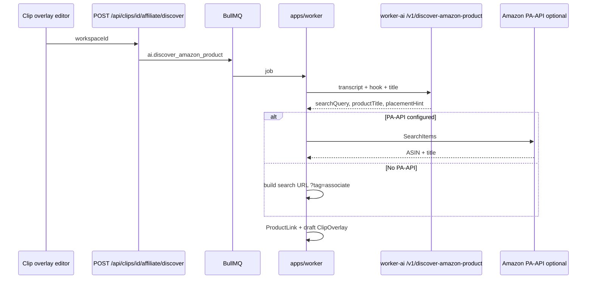

# Phase 10 — AI Amazon affiliate discovery

Help creators monetize Shorts by suggesting **relevant Amazon products** from clip context (transcript, hook, title) and attaching **their own Associates tag**.

## Goals

1. Each workspace stores an **Amazon Associates tag** (per-creator configuration).
2. **OpenAI-compatible** LLM picks a search query + product title from clip context.
3. Optional **Product Advertising API (PA-API 5)** resolves a real ASIN; otherwise a **search affiliate URL** is used.
4. Creates a `ProductLink` + draft `product_pin` overlay timed to transcript.

## Architecture



## Configuration

### Workspace (Monetization UI)

| Field | Purpose |
|-------|---------|
| `amazonAssociateTag` | Creator's `tag=` parameter (required for discovery) |
| `amazonMarketplace` | e.g. `www.amazon.com`, `www.amazon.co.uk` |
| `aiProductDiscoveryEnabled` | Toggle AI discovery jobs |

### Server environment (`.env`)

| Variable | Required | Purpose |
|----------|----------|---------|
| `OPENAI_API_KEY` | Recommended | LLM product matching |
| `OPENAI_BASE_URL` | No | ChatGPT-compatible API base (Azure, local, etc.) |
| `OPENAI_MODEL` | No | Default `gpt-4o-mini` |
| `WORKER_AI_URL` | Yes | Points to `services/worker-ai` |
| `AMAZON_PAAPI_ACCESS_KEY` | No | PA-API access key |
| `AMAZON_PAAPI_SECRET_KEY` | No | PA-API secret |
| `AMAZON_PAAPI_REGION` | No | Default `us-east-1` |
| `AMAZON_PAAPI_HOST` | No | Auto-derived from marketplace if unset |

Without PA-API, links use the format:

`https://www.amazon.com/s?k={searchQuery}&tag={associateTag}`

With PA-API, prefer direct product URLs:

`https://www.amazon.com/dp/{ASIN}?tag={associateTag}`

## API

### `POST /api/clips/[clipId]/affiliate/discover`

Body:

```json
{
  "workspaceId": "...",
  "replaceExistingDraft": true
}
```

Returns `202` with queued `job`.

Requires: approved/rendered clip, overlay feature enabled, Associates tag configured.

### `PATCH /api/workspaces/[id]/overlay-settings`

Includes affiliate fields (see workspace settings schema).

## Job

- **Type:** `ai.discover_amazon_product`
- **Handler:** `apps/worker/src/ai/run-discover-amazon-product.ts`
- **LLM:** `POST {WORKER_AI_URL}/v1/discover-amazon-product`

## UI

1. **Monetization** — Amazon Associates card (tag, marketplace, enable toggle).
2. **Clip overlays tab** — **Find Amazon product** button (queues discovery, refreshes drafts ~5s).

## Compliance

- Creators must own a valid **Amazon Associates** account and follow [Operating Agreement](https://affiliate-program.amazon.com/help/operating/agreement).
- Default disclosure text should mention Amazon (configurable in overlay settings).
- LLM must not suggest restricted products; prompt includes safety rules.
- ClipForge does not take a cut of affiliate revenue in OSS — tags are **per workspace**.

## PA-API vs LLM-only

| Mode | Pros | Cons |
|------|------|------|
| LLM + search URL | No PA-API approval; fast to ship | Less precise; search results page |
| LLM + PA-API | Real ASIN, title, price, image | Requires PA-API credentials + Associates linkage |

## Implemented in Phase 11

See [phase-11-multi-affiliate.md](phase-11-multi-affiliate.md):

- Auto-run discovery after clip approval (`autoDiscoverOnApprove`)
- Catalog dedup by `externalProductId`
- Product image upload to S3
- eBay, Walmart, Best Buy, Etsy fallback chain

## Acceptance criteria

- [x] Workspace can save Amazon Associates tag
- [x] Discover job creates `ProductLink` with `affiliateNetwork: amazon`
- [x] Draft `product_pin` overlay appears on clip
- [x] Works with OpenAI key; heuristic fallback without key
- [x] PA-API improves URL to `/dp/ASIN` when configured

> **Auto-updated by Cursor:** Phase 10 spec added 2026-05-19.
