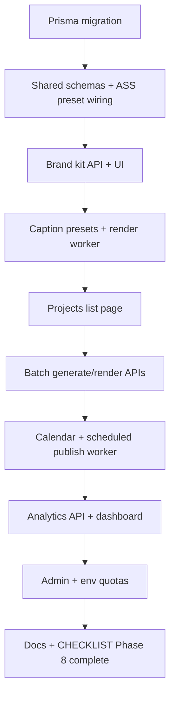

# Phase 8 — Polish (open source, no billing)

Implementation guide for creator-facing polish: brand kits, caption presets, scheduling calendar, batch operations, analytics, and self-hosted admin limits. ClipForge is **free and open source** — there is no Stripe or paid plan enforcement.

**Checklist:** [CHECKLIST.md](../CHECKLIST.md) → Phase 8  
**Depends on:** Phases 1–7 (render, publish, discovery)  
**Blocks:** Phase 9 (monetization overlays need brand kits)

---

## 1. Goals

| Goal | Outcome |
|------|---------|
| Consistent branding | Workspace-level fonts, colors, logos applied to captions and hooks |
| Faster workflows | Batch generate/render approved clips; calendar for scheduled publish |
| Visibility | Basic analytics on sources, clips, renders, publish jobs |
| Fair self-hosting | Optional env-based quotas (no payment provider) |
| OSS clarity | No Stripe; `WorkspacePlan` is informational or admin-assigned only |

---

## 2. Out of scope (Phase 8)

- Stripe or any payment integration
- Paid tier enforcement or checkout
- Phase 9 overlay editor (separate doc)
- Rights confirmation gate (pre-launch compliance)
- Full Instagram Graph automated publish

---

## 3. Data model (Prisma migration)

### 3.1 `BrandKit`

```prisma
model BrandKit {
  id          String   @id @default(cuid())
  workspaceId String
  name        String
  isDefault   Boolean  @default(false)
  logoStorageKey String?
  primaryColor   String   // hex
  secondaryColor String?
  fontFamily     String   @default("Inter")
  hookFontSize   Int      @default(48)
  createdAt   DateTime @default(now())
  updatedAt   DateTime @updatedAt

  workspace Workspace @relation(...)
  captionStyles CaptionStylePreset[]
}
```

- One default kit per workspace (enforce in API on set-default).
- Logo upload via existing S3 presign pattern (`brand-kits/{workspaceId}/{kitId}/logo.png`).

### 3.2 `CaptionStylePreset`

```prisma
model CaptionStylePreset {
  id          String @id @default(cuid())
  workspaceId String
  brandKitId  String?
  name        String
  presetKey   String // minimal | tiktok_highlight | podcast_bold | corporate | high_energy
  assTemplate Json   // ASS style overrides: font, colors, margins, karaoke
  isDefault   Boolean @default(false)
  ...
}
```

- Wire `RenderedClip.captionStyleId` → FK to `CaptionStylePreset` (nullable during migration).
- Render worker reads preset JSON in `packages/shared/src/render/ass.ts`.

### 3.3 `ScheduledPublish` (calendar)

```prisma
model ScheduledPublish {
  id               String   @id @default(cuid())
  workspaceId      String
  renderedClipId   String
  connectedAccountId String?
  platform         Platform
  scheduledFor     DateTime
  caption          String?
  hashtags         String[]
  status           String   // scheduled | published | cancelled | failed
  publishJobId     String?
  ...
}
```

- Cron or BullMQ delayed job: `publish.scheduled` at `scheduledFor`.
- Calendar UI reads this table + completed `PublishJob`.

### 3.4 Analytics (aggregate tables or views)

**MVP:** query existing tables; optional nightly rollup:

```prisma
model WorkspaceDailyStats {
  workspaceId String
  date        DateTime @db.Date
  sourcesImported Int
  clipsGenerated  Int
  clipsApproved   Int
  clipsRendered   Int
  publishAttempts Int
  publishSuccess  Int
  @@unique([workspaceId, date])
}
```

Populate via worker job `analytics.rollup` (daily) or compute on read for small deployments.

---

## 4. Shared package (`packages/shared`)

| Area | Files |
|------|--------|
| Brand kit schemas | `schemas/brand-kit.ts`, `types/brand-kit.ts` |
| Caption presets | `schemas/caption-style.ts`, extend `render/ass.ts` |
| Batch jobs | `schemas/batch.ts`, `config/batch.ts` (`MAX_BATCH_CLIPS`, etc.) |
| Quotas (OSS) | `config/quotas.ts` — read env: `MAX_SOURCES_PER_WORKSPACE`, `MAX_RENDERS_PER_DAY`; no billing |
| Calendar | `schemas/scheduled-publish.ts` |

Export from `packages/shared/src/index.ts`.

---

## 5. API routes (`apps/web`)

### 5.1 Brand kits

| Method | Route | Role |
|--------|-------|------|
| GET | `/api/brand-kits?workspaceId=` | viewer+ |
| POST | `/api/brand-kits` | editor+ |
| PATCH | `/api/brand-kits/[id]` | editor+ |
| DELETE | `/api/brand-kits/[id]` | admin+ |
| POST | `/api/brand-kits/[id]/logo/presign` | editor+ |

### 5.2 Caption presets

| Method | Route | Role |
|--------|-------|------|
| GET/POST/PATCH/DELETE | `/api/caption-styles/*` | same pattern |

Seed workspace with 4–6 built-in presets on first kit create.

### 5.3 Batch operations

| Method | Route | Body |
|--------|-------|------|
| POST | `/api/clips/batch-generate` | `{ workspaceId, sourceVideoId }` |
| POST | `/api/clips/batch-render` | `{ workspaceId, clipCandidateIds[], renderPreset?, captionStyleId? }` |

- Enqueue one BullMQ parent job `batch.render` that fans out `render.clip` children (or sequential with concurrency limit).
- Return `{ batchId, jobIds[] }` for status polling via existing `/api/jobs`.

### 5.4 Calendar / schedule

| Method | Route |
|--------|-------|
| GET | `/api/calendar?workspaceId=&from=&to=` |
| POST | `/api/scheduled-publish` |
| PATCH | `/api/scheduled-publish/[id]` (reschedule/cancel) |

### 5.5 Analytics

| Method | Route |
|--------|-------|
| GET | `/api/analytics/overview?workspaceId=&days=30` |
| GET | `/api/analytics/sources?workspaceId=` |

### 5.6 Admin (instance owner / env flag)

| Method | Route | Notes |
|--------|-------|-------|
| GET | `/api/admin/workspaces` | Requires `ADMIN_USER_IDS` env |
| PATCH | `/api/admin/workspaces/[id]/plan` | Set `WorkspacePlan` without payment |
| GET | `/api/admin/usage` | Queue depth, failed jobs |

Use `requireWorkspaceEditor` for workspace mutations; separate `requireAdmin` helper.

---

## 6. Worker jobs (`apps/worker`)

| Job type | Handler | Notes |
|----------|---------|-------|
| `batch.render` | Fan-out render.clip | Respect `BATCH_RENDER_CONCURRENCY` |
| `publish.scheduled` | Reuse publish.youtube / manual fallback | Delayed queue |
| `analytics.rollup` | Optional daily aggregates | Skip if table empty |

**Render integration:** `run-render-clip.ts` loads `CaptionStylePreset` by id; falls back to default workspace preset; applies `BrandKit` colors/fonts to ASS + hook drawtext.

---

## 7. UI pages (replace placeholders)

| Route | Current | Phase 8 |
|-------|---------|---------|
| `/brand-kits` | placeholder | List + editor form, logo upload, color pickers |
| `/projects` | placeholder | List `SourceVideo` with status badges, link to project |
| `/calendar` | placeholder | Month/week view of `ScheduledPublish` + past publishes |
| `/analytics` | placeholder | Charts: imports, clips, renders, publish success rate |
| Clip review | partial | Caption style dropdown; “Apply brand kit” on render dialog |
| `/accounts` | exists | Disconnect button → `DELETE /api/accounts/[id]` |
| Render preview | exists | Publish job status panel (poll `/api/publish/jobs`) |

---

## 8. Implementation order (recommended)



**Parallel tracks after migration:**

- Track A: Brand kits + caption presets + render
- Track B: Projects list + batch APIs
- Track C: Calendar + scheduled publish
- Track D: Analytics + admin

---

## 9. Acceptance criteria

- [ ] Workspace can create a default brand kit with logo and colors
- [ ] Render uses selected caption preset (ASS) and brand kit hook styling
- [ ] `/projects` lists sources with pipeline status (import → transcript → clips → render)
- [ ] User can batch-render all approved clips for a source (with progress via jobs)
- [ ] User can schedule a YouTube publish from calendar UI
- [ ] `/analytics` shows 30-day overview from real DB counts
- [ ] Admin can list workspaces and adjust plan enum without Stripe
- [ ] Env quotas return 429 when exceeded (documented in `.env.example`)
- [ ] No Stripe references in code, checklist, or user-facing copy
- [ ] Viewers cannot import, approve, render, or publish (editor+ only)

---

## 10. Environment variables

```env
# Optional OSS limits (unset = unlimited)
MAX_SOURCES_PER_WORKSPACE=50
MAX_RENDERS_PER_DAY=100
BATCH_RENDER_CONCURRENCY=2

# Admin (comma-separated user ids)
ADMIN_USER_IDS=
```

---

## 11. Testing checklist

1. Create brand kit → render clip → verify ASS colors match kit
2. Batch-render 3 approved clips → all `RenderedClip` reach `ready`
3. Schedule publish 2 min ahead → job runs → `PublishJob` succeeded or failed with message
4. Viewer role: GET projects OK; POST import → 403
5. `pnpm typecheck` passes at repo root
6. Disconnect YouTube account → publish blocked until reconnect

---

## 12. Documentation updates

- [developer.md](./developer.md) — brand kits, batch, calendar, quotas
- [CHECKLIST.md](../CHECKLIST.md) — mark Phase 8 items; remove Stripe line
- [README.md](../README.md) — note OSS / free positioning

> **Auto-updated by Cursor:** Phase 8 plan created 2026-05-18; Stripe removed (OSS).
