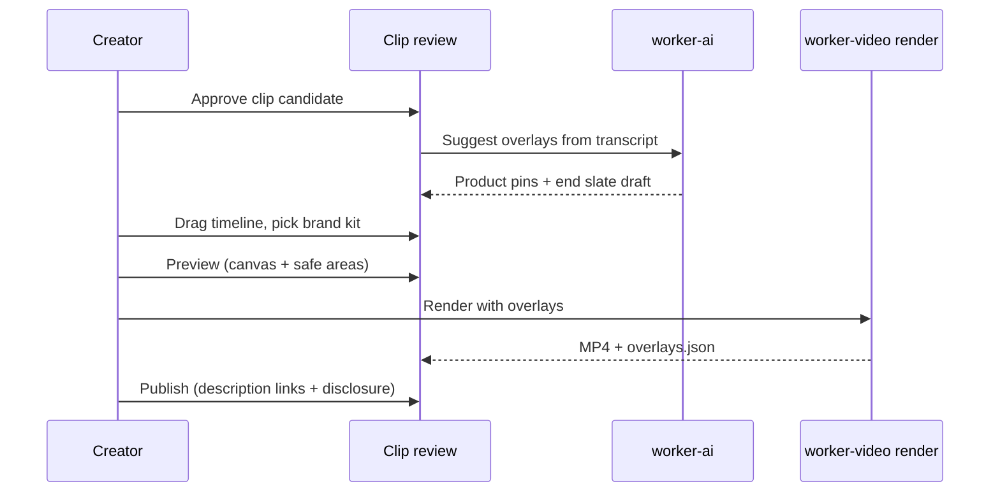
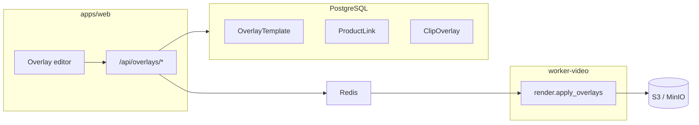

# Phase 9 — Monetization & Interactive Overlays

Implementation guide for ads, affiliate links, product CTAs, and sponsored segments burned into or bundled with rendered clips. This phase extends the core clip pipeline without blocking MVP (Phases 1–7).

**Checklist:** [CHECKLIST.md](../CHECKLIST.md) → Phase 9  
**Related spec:** [clipforge_ai_shorts_platform_cursor_spec.md](./clipforge_ai_shorts_platform_cursor_spec.md) §8.8 (hook overlay), §9.1 (brand kits), §14.3–14.4 (safe areas)

---

## 1. Goals

| Goal | Outcome |
|------|---------|
| Monetize clips | Creators attach products, promos, and sponsor CTAs without leaving ClipForge |
| Stay compliant | Disclosures and safe URLs are defaults, not afterthoughts |
| Feel native | Overlays respect 9:16 safe zones and never fight captions |
| Stay optional | “Clean” export always available; overlays are an explicit layer |

---

## 2. User experience (happy path)



1. **After** clip approval (Phase 4), open **Overlays** tab on the clip.
2. AI proposes 0–3 overlays (e.g. product mention at 0:12 → product pin; end slate last 3s).
3. Creator adjusts timing on a dedicated overlay lane; preview updates in near real time (client compositor) and exactly on final render (FFmpeg).
4. Compliance panel shows required disclosure; publish is blocked until acknowledged for affiliate/sponsored types.
5. Choose **Monetized render** or **Clean render** (captions + hook only).

---

## 3. Overlay taxonomy

| Type | `overlayType` | Typical duration | Safe zone |
|------|---------------|------------------|-----------|
| End slate | `end_slate` | 2–4s at clip end | Full frame; keep CTA above bottom 320px |
| Product pin | `product_pin` | 3–8s, scene-aligned | Right or left stack; avoid caption band |
| Affiliate lower-third | `affiliate_bar` | 4–10s | Bottom third, above caption margin |
| Sponsored marker | `sponsor_segment` | Start→end of paid read | Top bar, low opacity |
| Promo code flash | `promo_code` | 2–3s | Center; max once per 30s |
| QR / link card | `qr_card` | 3–5s (usually end) | Center or bottom-right |
| Custom image | `image` | User-defined | User-defined with snap guides |

All types share a common **OverlayInstance** shape (see §5).

---

## 4. Architecture



- **Authoring** lives in Next.js (timeline UI + Zod-validated API).
- **Composition** runs in `worker-video` after base vertical render (Phase 5), as `render.apply_overlays` or a sub-step of `render_clip`.
- **Catalog** (`ProductLink`, `OverlayTemplate`) is workspace-scoped; reuse across projects.

---

## 5. Data model (proposed Prisma)

Add after Phase 8 brand kit tables exist (or extend `BrandKit` with overlay defaults).

```prisma
enum OverlayType {
  end_slate
  product_pin
  affiliate_bar
  sponsor_segment
  promo_code
  qr_card
  image
}

enum OverlayCompliance {
  none
  affiliate
  sponsored
  ad
}

model OverlayTemplate {
  id          String      @id @default(cuid())
  workspaceId String
  name        String
  overlayType OverlayType
  config      Json        // layout, fonts, colors — matches renderer schema
  createdAt   DateTime    @default(now())
  updatedAt   DateTime    @updatedAt

  workspace Workspace @relation(fields: [workspaceId], references: [id], onDelete: Cascade)
}

model ProductLink {
  id              String   @id @default(cuid())
  workspaceId     String
  title           String
  url             String
  imageUrl        String?
  priceLabel      String?  // e.g. "$29", "From $19"
  affiliateNetwork String? // amazon, shopify, custom
  disclosureText  String?  // override workspace default
  active          Boolean  @default(true)
  createdAt       DateTime @default(now())
  updatedAt       DateTime @updatedAt

  workspace Workspace @relation(fields: [workspaceId], references: [id], onDelete: Cascade)
}

model ClipOverlay {
  id              String            @id @default(cuid())
  clipCandidateId String
  overlayType     OverlayType
  templateId      String?
  productLinkId   String?
  startMs         Int
  endMs           Int
  position        Json              // { anchor, x, y, width, height } normalized 0–1
  style           Json              // merged template + per-instance overrides
  compliance      OverlayCompliance @default(none)
  sortOrder       Int               @default(0)
  createdAt       DateTime          @default(now())
  updatedAt       DateTime          @updatedAt

  clipCandidate ClipCandidate  @relation(fields: [clipCandidateId], references: [id], onDelete: Cascade)
  template      OverlayTemplate? @relation(fields: [templateId], references: [id], onDelete: SetNull)
  productLink   ProductLink?     @relation(fields: [productLinkId], references: [id], onDelete: SetNull)
}
```

**Zod:** mirror enums in `packages/shared/src/schemas/overlay.ts` for API routes.

---

## 6. Renderer contract

Worker receives:

```json
{
  "renderedClipId": "…",
  "baseVideoKey": "s3://…/vertical.mp4",
  "overlays": [
    {
      "type": "product_pin",
      "startMs": 12000,
      "endMs": 18000,
      "position": { "anchor": "bottom_right", "marginPx": 80 },
      "assets": { "imageKey": "…", "title": "Wireless mic", "cta": "Shop" },
      "style": { "fontFamily": "Inter", "accentColor": "#F97316" }
    }
  ],
  "safeAreas": { "top": 180, "bottom": 320, "left": 80, "right": 80 }
}
```

Implementation options (pick one in Phase 9 spike):

1. **FFmpeg `drawtext` + `overlay` filter graph** — good for MVP, deterministic.
2. **Pillow / Skia frame compositor** — easier complex layouts; slower.
3. **Remotion-style JSON → video** — defer unless batch templating is critical.

Output:

- `…/monetized.mp4` — with overlays
- `…/clean.mp4` — without (copy of pre-overlay render)
- `…/overlays.json` — manifest for audit and republish

---

## 7. API surface (sketch)

| Method | Route | Purpose |
|--------|-------|---------|
| `GET` | `/api/workspaces/:id/overlay-templates` | List templates |
| `POST` | `/api/workspaces/:id/overlay-templates` | Create template |
| `GET` | `/api/workspaces/:id/product-links` | Product catalog |
| `POST` | `/api/workspaces/:id/product-links` | CRUD product |
| `GET` | `/api/clips/:clipCandidateId/overlays` | List instances |
| `PUT` | `/api/clips/:clipCandidateId/overlays` | Replace all (timeline save) |
| `POST` | `/api/clips/:clipCandidateId/overlays/suggest` | Enqueue AI suggest job |
| `POST` | `/api/clips/:clipCandidateId/render` | Body: `{ includeOverlays: true \| false }` |

All routes: workspace auth + editor role minimum for mutations.

---

## 8. Editor UI notes

**Location:** Project → clip detail → **Overlays** tab (alongside Transcript, Captions, Publish).

**Components:**

- `OverlayTimeline` — second lane under transcript; draggable blocks; snap to word boundaries from `TranscriptWord`.
- `OverlayPreviewCanvas` — 9:16 with dashed safe-area guides per platform preset.
- `OverlayInspector` — type-specific fields (product picker, promo code, disclosure toggle).
- `OverlayPresetGallery` — thumbnails from `OverlayTemplate`.

**Smooth UX details:**

- Undo/redo stack for overlay edits (session-local).
- “Apply to all approved clips” wizard with preview grid.
- Conflict badge when overlay overlaps caption bounding box (client-side geometry check).
- Empty state: “No overlays — export clean clip” with one-click add end slate.

---

## 9. AI suggestion job (`ai.suggest_overlays`)

Input: `clipCandidateId`, transcript segments, optional `ProductLink[]`.

Logic:

1. NER / keyword match on product names and URLs mentioned in transcript.
2. Propose `startMs`/`endMs` at sentence boundaries containing matches.
3. Default `compliance: affiliate` when `ProductLink.affiliateNetwork` is set.
4. Cap suggestions at 3 per clip; prefer end slate + one mid-roll pin.

Store suggestions as draft `ClipOverlay` rows (`draft: true` flag) until user confirms.

---

## 10. Compliance

| Requirement | Implementation |
|-------------|----------------|
| FTC / ASA disclosures | Workspace default + per-overlay override; required checkbox before export |
| Affiliate URLs | Validate HTTPS; optional domain allowlist per workspace |
| Platform branded content | Publish flow copies disclosure into description template |
| Clean export | Always available; no affiliate burn-in without explicit render flag |

**Copy templates (examples):**

- Affiliate bar: “Links may earn a commission.”
- Sponsored segment: “Paid partnership with {brand}.”
- Ad overlay: “Advertisement.”

---

## 11. Publishing integration

- **Description builder:** concatenate tracked links from active overlays (`utm_source=clipforge&utm_medium=short&utm_campaign={clipId}`).
- **YouTube:** if product metadata API is available, map `ProductLink` → external product IDs (later).
- **TikTok / Instagram:** rely on caption + link-in-bio; burned QR for regions where link stickers are limited.
- **Fallback:** download `links.txt` + `overlays.json` with rendered MP4.

---

## 12. Analytics (optional tail)

- `OverlayEvent`: `impression` (render-time proxy), `click` (redirect endpoint `/r/:slug`).
- Dashboard widget: CTR by overlay type and product.
- Agency plan: A/B two overlay packs on duplicate renders.

---

## 13. Phasing within Phase 9

| Slice | Deliverable |
|-------|-------------|
| **9a** | Schema + CRUD + end slate + affiliate bar render |
| **9b** | Timeline editor + safe areas + clean vs monetized export |
| **9c** | Product catalog + AI suggest + product pin |
| **9d** | Compliance gate + publish description links |
| **9e** | Analytics + feed imports + A/B |

---

## 14. Dependencies & risks

| Dependency | Notes |
|------------|-------|
| Phase 5 render | Base vertical MP4 must exist before overlay pass |
| Phase 8 brand kits | Fonts, colors, logo for templates |
| Phase 3 transcript | Word-level timing for snap and AI suggest |

| Risk | Mitigation |
|------|------------|
| Overlay covers captions | Safe-area engine + client warnings |
| Policy violations | Disclosure required; URL safety check |
| Render time | Cache assets; limit concurrent overlay filters |
| Stale affiliate links | Catalog `active` flag + pre-publish validation job |

---

## 15. Acceptance criteria (Phase 9 done)

- [ ] Creator can add end slate and affiliate bar to an approved clip with timeline control
- [ ] Preview shows safe areas; warnings when overlapping captions
- [ ] Monetized and clean MP4 both downloadable
- [ ] Product pin linked from workspace catalog; AI can suggest placement
- [ ] Publish blocked without disclosure when compliance type is affiliate/sponsored/ad
- [ ] Description includes tracked links derived from overlays
- [ ] `overlays.json` manifest stored alongside render in S3

---

## 16. Resolved implementation decisions (2026-05-18)

| Question | Decision |
|----------|----------|
| Compositor location | **Node `apps/worker`** (not Python `worker-video`) |
| Job chaining | **`render.clip`** writes `clean.mp4`; **`render.apply_overlays`** writes `output.mp4` + `overlays.json` when overlays exist or `includeOverlays` is true |
| Client preview | **Canvas 2D** safe-area mock (FFmpeg is export source of truth) |
| Click tracking | **First-party** `GET /r/[slug]` + `OverlayEvent` |
| Product feeds | **CSV import** for OSS; Shopify/Amazon deferred |
| Feature flag | `CLIPFORGE_OVERLAYS_ENABLED` (default on when unset) |
| Playback file | `RenderedClip.storageKey` → monetized `output.mp4` when overlays applied; `cleanStorageKey` for clean download |

### Follow-up polish (optional)

- Burn product `imageStorageKey` in FFmpeg overlay pass
- LLM CTA variant picker (`OPENAI_API_KEY`)
- YouTube Shopping API product tags
- Drag-and-drop timeline + keyboard nudge in overlay editor
